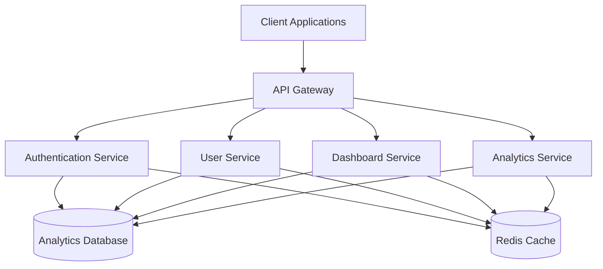
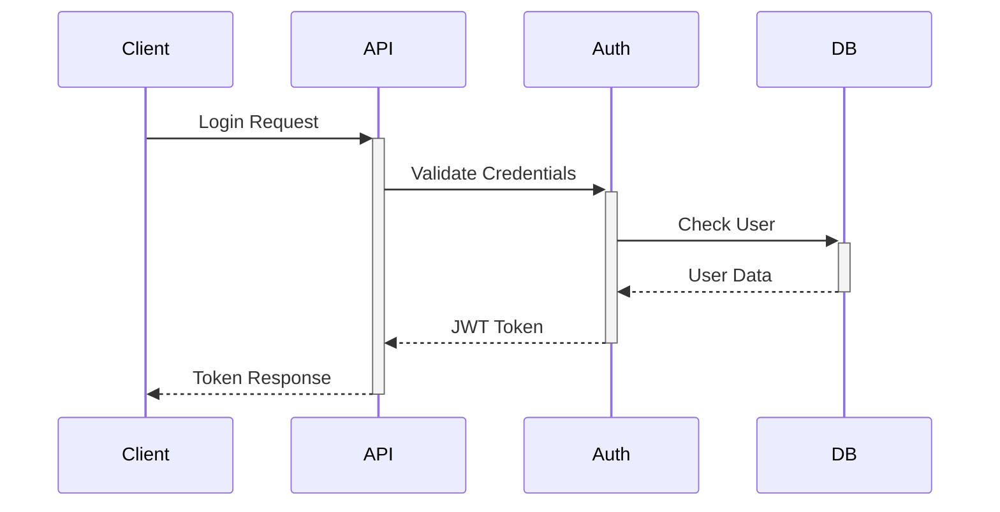
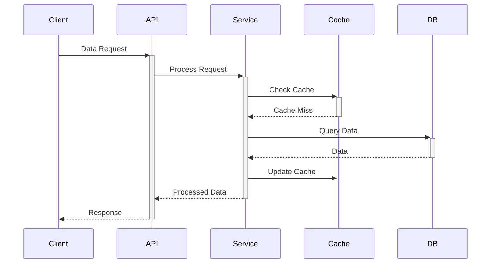

# System Architecture

This document provides a comprehensive overview of the system architecture, including the technical stack, component interactions, and design decisions.

## System Overview

## Technology Stack

### Backend Services
- **API Gateway**: Node.js with Express
- **Authentication**: JWT-based auth with refresh tokens
- **Database**: PostgreSQL with Prisma ORM
- **Caching**: Redis
- **Message Queue**: RabbitMQ
- **Search**: Elasticsearch

### Frontend Applications
- **Web Dashboard**: React with TypeScript
- **Mobile App**: React Native
- **Admin Panel**: React with Material-UI

### Infrastructure
- **Containerization**: Docker
- **Orchestration**: Kubernetes
- **CI/CD**: GitHub Actions
- **Monitoring**: Prometheus & Grafana
- **Logging**: ELK Stack

## Component Details

### 1. API Gateway
- Handles routing and load balancing
- Implements rate limiting
- Manages API versioning
- Handles request/response transformation

### 2. Authentication Service
- User authentication and authorization
- JWT token management
- OAuth2 integration
- Role-based access control

### 3. User Service
- User management
- Profile management
- Team management
- Permission management

### 4. Dashboard Service
- Data aggregation
- Real-time updates
- Custom widget management
- Dashboard sharing

### 5. Analytics Service
- Data collection
- Processing pipeline
- Reporting engine
- Data export

## Data Flow

### Authentication Flow

### Data Processing Flow

## Security Architecture

### 1. Network Security
- VPC configuration
- Security groups
- Network ACLs
- DDoS protection

### 2. Application Security
- Input validation
- Output encoding
- CSRF protection
- XSS prevention

### 3. Data Security
- Encryption at rest
- Encryption in transit
- Key management
- Data backup

## Scalability

### 1. Horizontal Scaling
- Stateless services
- Load balancing
- Database sharding
- Cache distribution

### 2. Vertical Scaling
- Resource optimization
- Connection pooling
- Query optimization
- Cache strategies

## Monitoring and Observability

### 1. Metrics
- Service health
- Performance metrics
- Business metrics
- Resource utilization

### 2. Logging
- Application logs
- Access logs
- Error logs
- Audit logs

### 3. Tracing
- Request tracing
- Performance tracing
- Error tracing
- Dependency tracing

## Disaster Recovery

### 1. Backup Strategy
- Database backups
- Configuration backups
- Code backups
- Documentation backups

### 2. Recovery Procedures
- Service recovery
- Data recovery
- Configuration recovery
- Testing procedures

## Development Workflow

### 1. Environment Strategy
- Development
- Staging
- Production
- Testing

### 2. Deployment Strategy
- Blue-green deployment
- Canary releases
- Rollback procedures
- Version management

## Technical Decisions

### 1. Database Choice
- PostgreSQL for relational data
- Redis for caching
- Elasticsearch for search
- Rationale and alternatives considered

### 2. API Design
- RESTful principles
- GraphQL for complex queries
- Versioning strategy
- Documentation approach

### 3. Frontend Architecture
- Component design
- State management
- Routing strategy
- Build optimization

## Future Considerations

### 1. Planned Improvements
- Service mesh implementation
- Enhanced monitoring
- Performance optimization
- Security enhancements

### 2. Scalability Plans
- Microservices decomposition
- Database scaling
- Cache optimization
- Load distribution

## References

- [System Requirements](../requirements.md)
- [API Documentation](../api/README.md)
- [Deployment Guide](../deployment/README.md)
- [Security Guidelines](../security/README.md) 